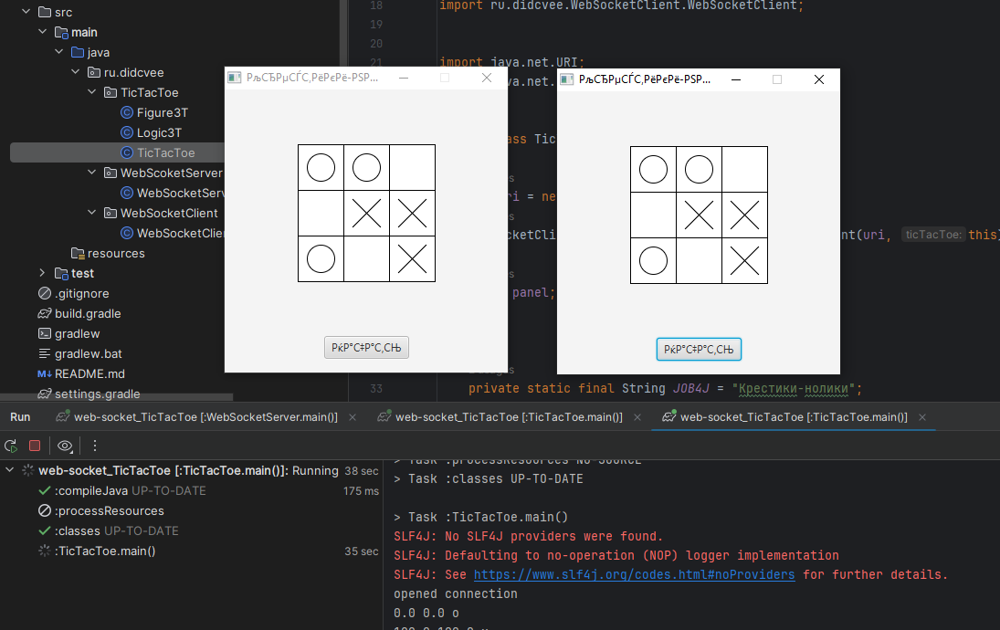

 

  

<h3 align="center">Train websocket</h3>

<!-- ABOUT THE PROJECT -->
## About The Project

Training with websocket, the [Java_Websocket](https://github.com/TooTallNate/Java-WebSocket) library was used, javafx was also used.
* Java 8
* org.java-websocket:Java-WebSocket:1.5.4
* JavaFX

